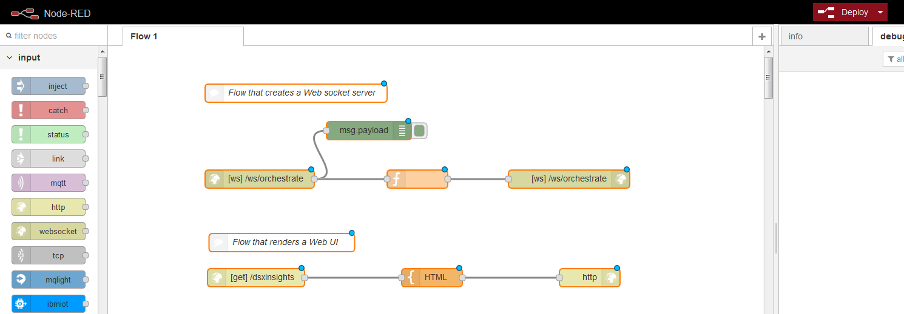
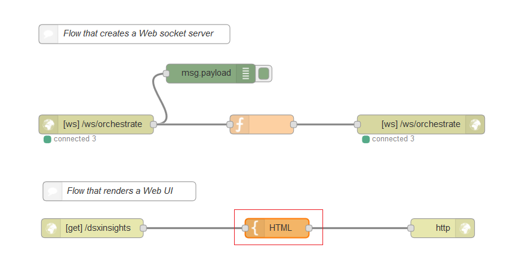
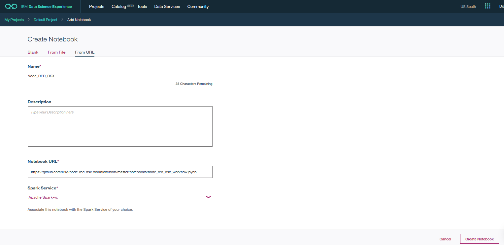
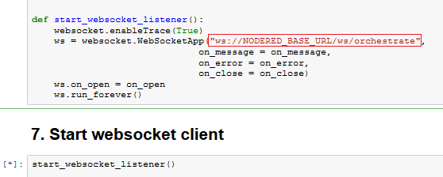

# Orchestration of the analytics workflow in IBM Watson Studio using a custom web user-interface built with Node-RED

IBM Watson Studio can be used to analyze data using Jupyter notebooks. There is no mechanism exposed by Watson Studio to trigger execution of the notebook cells from outside. If this capability is added, we can build a complete end to end analytics solution using IBM Watson Studio.

The below two requirements are addressed by this journey to help build a complete analytics solution with IBM Watson Studio.
* Trigger the execution of Python code in a Jupyter Notebook on IBM Watson Studio from a custom web user interface
* Visualize the response from the Python code execution in a Jupyter Notebook on IBM Watson Studio on the custom web user interface

We will use [Node-RED](https://nodered.org/) to invoke the analytics workflows in Jupyter notebooks on IBM Watson Studio and also to render a custom web user-interface with minimal programming.

#### What is Node-RED?
Node-RED is a tool for wiring together APIs and online services on IBM Cloud. The APIs and online services are configured as nodes that can be wired to orchestrate a workflow. It is also a web server where the UI solution can be deployed. It has nodes that support integration with many database services, watson services and analytics services.

Node-RED reduces a lot of development effort. It is easy to improve the solution using other services with Node-RED. It opens a world of possibilities for developers.

When the reader has completed this journey, they will understand how to:

* Create and run a Jupyter notebook in Watson Studio.
* Use Object Storage to access data files.
* Use Python Pandas to derive insights on the data.
* Develop a custom web user interface using Node-RED.
* Triggering an analytics workflow on Watson Studio from the UI using Node-RED.

The intended audience for this journey are developers who want to develop a complete analytics solution on Watson Studio with a custom web user interface.

1. The Object storage stores the data.
2. Data is utilized as csv files.
3. The Jupyter notebook processes the data and generates insights.
4. The Jupyter notebook is powered by Spark.
5. The Node-RED hosts a websocket server that is a medium of communication between the Jupyter notebook on IBM Watson Studio and Web UI.
6. The Node-RED hosts a web server that renders the Web UI.

## Included components

* [Node-RED](https://console.bluemix.net/catalog/starters/node-red-starter): Node-RED is a programming tool for wiring together APIs and online services.

* [IBM Watson Studio](https://apsportal.ibm.com/analytics): Analyze data using RStudio, Jupyter, and Python in a configured, collaborative environment that includes IBM value-adds, such as managed Spark.

* [IBM Cloud Object Storage](https://console.bluemix.net/catalog/infrastructure/cloud-object-storage): An IBM Cloud service that provides an unstructured cloud data store to build and deliver cost effective apps and services with high reliability and fast speed to market.

* [Jupyter Notebooks](http://jupyter.org/): An open-source web application that allows you to create and share documents that contain live code, equations, visualizations and explanatory text.

## Featured technologies

* [Data Science](https://medium.com/ibm-data-science-experience/): Systems and scientific methods to analyze structured and unstructured data in order to extract knowledge and insights.

# Watch the Video

# Steps

Follow these steps to setup and run this developer journey. The steps are
described in detail below.

1. [Sign up for the Watson Studio](#1-sign-up-for-the-data-science-experience)
1. [Create IBM Cloud services](#2-create-ibm-cloud-services)
1. [Import the Node-RED flow](#3-import-the-node-red-flow)
1. [Note the websocket URL](#4-note-the-websocket-url)
1. [Update the websocket URL](#5-update-the-websocket-url)
1. [Create the notebook](#6-create-the-notebook)
1. [Add the data](#7-add-the-data)
1. [Update the notebook with service credentials](#8-update-the-notebook-with-service-credentials)
1. [Run the notebook](#9-run-the-notebook)
1. [Analyze the results](#10-analyze-the-results)

## 1. Sign up for the Watson Studio

Sign up for IBM's [Watson Studio](https://datascience.ibm.com/). By signing up for the Watson Studio, two services will be created - Spark and ObjectStore in your Bluemix account. 

## 2. Create IBM Cloud services

* Create the [Node-RED Starter application](https://console.bluemix.net/catalog/starters/node-red-starter).
* Choose an appropriate name for the Node-RED application - `App name:`.
* Click on `Create`.

  * [**Node-RED Starter**](https://console.bluemix.net/catalog/starters/node-red-starter)

  

  * On the newly created Node-RED application page, Click on `Visit App URL` to launch the Node-RED editor once the application is in `Running` state.
  * On the `Welcome to your new Node-RED instance on IBM Cloud` screen, Click on `Next`.
  * On the `Secure your Node-RED editor` screen, enter a username and password to secure the Node-RED editor and click on `Next`.
  * On the `Browse available IBM Cloud nodes` screen, click on `Next`.
  * On the `Finish the install` screen, click on Finish.
  * Click on `Go to your Node-RED flow editor`.  
  
## 3. Import the Node-RED flow
* [Clone this repo](https://github.com/IBM/node-red-dsx-workflow).
* Navigate to the [orchestrate_dsx_workflow.json](https://github.com/IBM/node-red-dsx-workflow/blob/master/node-red-flow/orchestrate_dsx_workflow.json).
* Open the file with a text editor and copy the contents to Clipboard.
* On the Node-RED flow editor, click the Menu and select `Import` -> `Clipboard` and paste the contents.

 
  
  

 #### Deploy the Node-RED flow by clicking on the `Deploy` button

## 4. Note the websocket URL

The websocket URL is ws://`<NODERED_BASE_URL>`/ws/orchestrate  where the `NODERED_BASE_URL` is the marked portion of the URL in the above image.
### Note:
An example websocket URL for a Node-RED app with name `myApp` is `ws://myApp.mybluemix.net/ws/orchestrate`, where `myApp.mybluemix.net` is the `NODERED_BASE_URL`.

The `NODERED_BASE_URL` may have additional region information i.e. `eu-gb` for the UK region. In this case `NODERED_BASE_URL` would be: `myApp.eu-gb.mybluemix.net`.

## 5. Update the websocket URL in HTML code
Click on the node named `HTML`.

Click on the HTML area and search for `ws:` to locate the line where the websocket URL is specified.
Update the websocket URL with the base URL that was noted in the [Section 4](#4-note-the-websocket-url):

	var websocketURL = "ws://NODERED_BASE_URL/ws/orchestrate";

Click on `Done` and re-deploy the flow.

## 6. Create the notebook

* Open [IBM Watson Studio](https://apsportal.ibm.com/analytics).
* Use the menu on the top to select `Projects` and then `Default Project`.
* Click on `Add notebooks` (upper right) to create a notebook.
* Select the `From URL` tab.
* Enter a name for the notebook.
* Optionally, enter a description for the notebook.
* Enter this Notebook URL: https://github.com/IBM/node-red-dsx-workflow/blob/master/notebooks/node_red_dsx_workflow.ipynb
* Click the `Create Notebook` button.

## 7. Add the data

#### Add the data to the notebook
* Please download the files - `summer.csv` and `dictionary.csv` from:
https://www.kaggle.com/the-guardian/olympic-games.
* Rename the file `summer.csv` to `olympics.csv`
* From your project page in Watson Studio, click `Find and Add Data` (look for the `10/01` icon)
and its `Files` tab.
* Click `browse` and navigate to where you downloaded `olympics.csv` and `dictionary.csv` on your computer.
* Add the files to Object storage.

## 8. Update the notebook with service credentials and websocket URL

#### Add the Object Storage credentials to the notebook
* Select the cell below `2.1 Add your service credentials for Object Storage` section in the notebook to update the credentials for Object Store.
* Use `Find and Add Data` (look for the `10/01` icon) and its `Files` tab. You should see the file names uploaded earlier. Make sure your active cell is the empty one created earlier.
* Select `Insert to code` below `olympics.csv`.
* Click `Insert Crendentials` from the drop down menu.
* If the credentials are written as `credential_2` change them to `credentials_1`.

#### Update the websocket URL in the notebook
* In the cell below `6. Expose integration point with a websocket client`, update the websocket url noted in [section 4](#4-note-the-websocket-url) in the `start_websocket_listener` function.

## 9. Run the notebook

When a notebook is executed, what is actually happening is that each code cell in
the notebook is executed, in order, from top to bottom.

Each code cell is selectable and is preceded by a tag in the left margin. The tag
format is `In [x]:`. Depending on the state of the notebook, the `x` can be:

* A `blank`, this indicates that the cell has never been executed.
* A `number`, this number represents the relative order this code step was executed.
* A `*`, this indicates that the cell is currently executing.

There are several ways to execute the code cells in your notebook:

* One cell at a time.
  * Select the cell, and then press the `Play` button in the toolbar.
* Batch mode, in sequential order.
  * From the `Cell` menu bar, there are several options available. For example, you
    can `Run All` cells in your notebook, or you can `Run All Below`, that will
    start executing from the first cell under the currently selected cell, and then
    continue executing all cells that follow.
* At a scheduled time.
  * Press the `Schedule` button located in the top right section of your notebook
    panel. Here you can schedule your notebook to be executed once at some future
    time, or repeatedly at your specified interval.

For this Notebook, you can simply `Run All` cells.
The websocket client will be started when you run the cell under `7. Start websocket client`. This will start the communication between the UI and the Notebook.

## 10. Analyze the results

The UI can be accessed at the URL: http://`<NODERED_BASE_URL>`/dsxinsights.
The `<NODERED_BASE_URL>` is the base URL noted in section [Note the websocket URL](#4-note-the-websocket-url).

# Troubleshooting

[See DEBUGGING.md.](DEBUGGING.md)

# License

[Apache 2.0](LICENSE)

